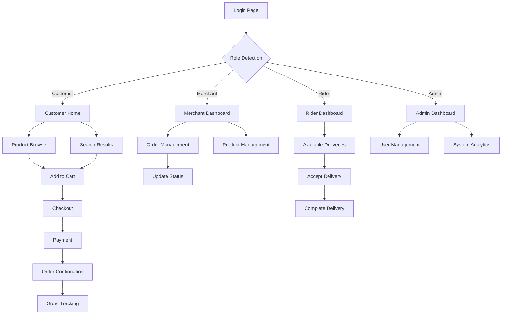

## 1. Product Overview
A comprehensive delivery platform portal that connects customers with merchants and riders for seamless food and goods delivery. The platform enables multi-role management with dedicated interfaces for Admin, Merchant, Rider, and Customer users.

This system solves the logistics challenge of connecting local businesses with customers through an efficient delivery network, providing real-time order tracking, payment processing, and role-based access control.

## 2. Core Features

### 2.1 User Roles
| Role | Registration Method | Core Permissions |
|------|---------------------|------------------|
| Admin | Manual creation by system | Full system access, user management, platform settings |
| Merchant | Self-registration with business verification | Create/manage products, process orders, view analytics |
| Rider | Self-registration with identity verification | Accept/reject delivery requests, update delivery status |
| Customer | Self-registration with email/phone | Browse products, place orders, track deliveries |

### 2.2 Feature Module
Our delivery platform consists of the following main pages:
1. **Login Page**: User authentication with role-based redirection
2. **Admin Dashboard**: System overview, user management, platform analytics
3. **Merchant Dashboard**: Product management, order processing, sales analytics
4. **Rider Dashboard**: Available deliveries, route management, earnings tracking
5. **Customer Home**: Product browsing, search, featured merchants
6. **Customer Cart**: Order customization, checkout process
7. **Order Tracking**: Real-time delivery status updates
8. **Profile Management**: User settings, payment methods, order history

### 2.3 Page Details
| Page Name | Module Name | Feature description |
|-----------|-------------|---------------------|
| Login Page | Authentication | Validate credentials, role detection, redirect to appropriate dashboard |
| Admin Dashboard | System Overview | Display platform statistics, user registrations, order volumes |
| Admin Dashboard | User Management | Create/edit users, role assignments, account status management |
| Merchant Dashboard | Product Management | Add/edit products, set prices, manage inventory |
| Merchant Dashboard | Order Processing | View incoming orders, update order status, manage preparation time |
| Merchant Dashboard | Analytics | View sales reports, popular items, revenue trends |
| Rider Dashboard | Available Deliveries | List nearby delivery requests, accept/reject orders |
| Rider Dashboard | Route Management | GPS navigation, delivery sequence optimization |
| Rider Dashboard | Earnings Tracking | View completed deliveries, calculate commissions |
| Customer Home | Product Browsing | Search products, filter by category, view merchant profiles |
| Customer Home | Featured Section | Display popular merchants, promotional offers |
| Customer Cart | Order Customization | Add/remove items, special instructions, quantity selection |
| Customer Cart | Checkout Process | Address selection, payment method, delivery scheduling |
| Order Tracking | Real-time Updates | Live delivery status, estimated arrival time |
| Order Tracking | Communication | Chat with rider, contact merchant support |
| Profile Management | User Settings | Update personal information, change password |
| Profile Management | Payment Methods | Add/remove cards, set default payment method |
| Profile Management | Order History | View past orders, reorder favorites, download receipts |

## 3. Core Process

### Customer Flow
Customers begin by browsing available merchants and products on the home page. They can search for specific items or filter by categories. Once they find desired products, they add them to their cart with customization options. The checkout process includes address selection, payment method choice, and delivery time preference. After order placement, customers receive real-time updates on order preparation and delivery status through the tracking page.

### Merchant Flow
Merchants log in to access their dashboard where they manage their product catalog, including adding new items, updating prices, and controlling availability. When orders arrive, merchants receive notifications and update order status as they prepare items. They can view detailed analytics about sales performance, popular products, and customer feedback.

### Rider Flow
Riders access their dashboard to view available delivery requests in their area. They can accept deliveries based on distance and estimated earnings. Once accepted, riders receive navigation guidance to the merchant location, then to the customer address. They update delivery status throughout the journey and can communicate with customers if needed.

### Admin Flow
Administrators have comprehensive access to monitor platform operations. They can view system-wide analytics, manage user accounts across all roles, configure platform settings, and handle disputes or support requests.

## 4. User Interface Design

### 4.1 Design Style
- **Primary Colors**: Deep blue (#1E40AF) for primary actions, emerald (#10B981) for success states
- **Secondary Colors**: Gray (#6B7280) for secondary text, red (#EF4444) for alerts
- **Button Style**: Rounded corners (8px radius), hover effects with subtle shadows
- **Typography**: Inter font family, 16px base size, responsive scaling
- **Layout**: Card-based design with consistent spacing (8px grid system)
- **Icons**: Heroicons library for consistent iconography

### 4.2 Page Design Overview
| Page Name | Module Name | UI Elements |
|-----------|-------------|-------------|
| Login Page | Authentication | Centered card layout, gradient background, role selector dropdown |
| Admin Dashboard | System Overview | Grid layout with metric cards, line charts for trends, data tables |
| Merchant Dashboard | Product Management | Table with product images, inline editing, bulk actions dropdown |
| Rider Dashboard | Available Deliveries | Map integration, card list of deliveries with distance/time info |
| Customer Home | Product Browsing | Masonry grid layout, product cards with images and ratings |
| Customer Cart | Order Summary | Sticky sidebar with order total, expandable item details |
| Order Tracking | Status Timeline | Vertical timeline with status icons, real-time map view |

### 4.3 Responsiveness
Desktop-first design approach with mobile adaptation. Breakpoints at 640px (mobile), 768px (tablet), 1024px (desktop). Touch-optimized interactions for mobile users with larger tap targets and swipe gestures for navigation.

### 4.4 3D Scene Guidance
Not applicable for this delivery platform portal.