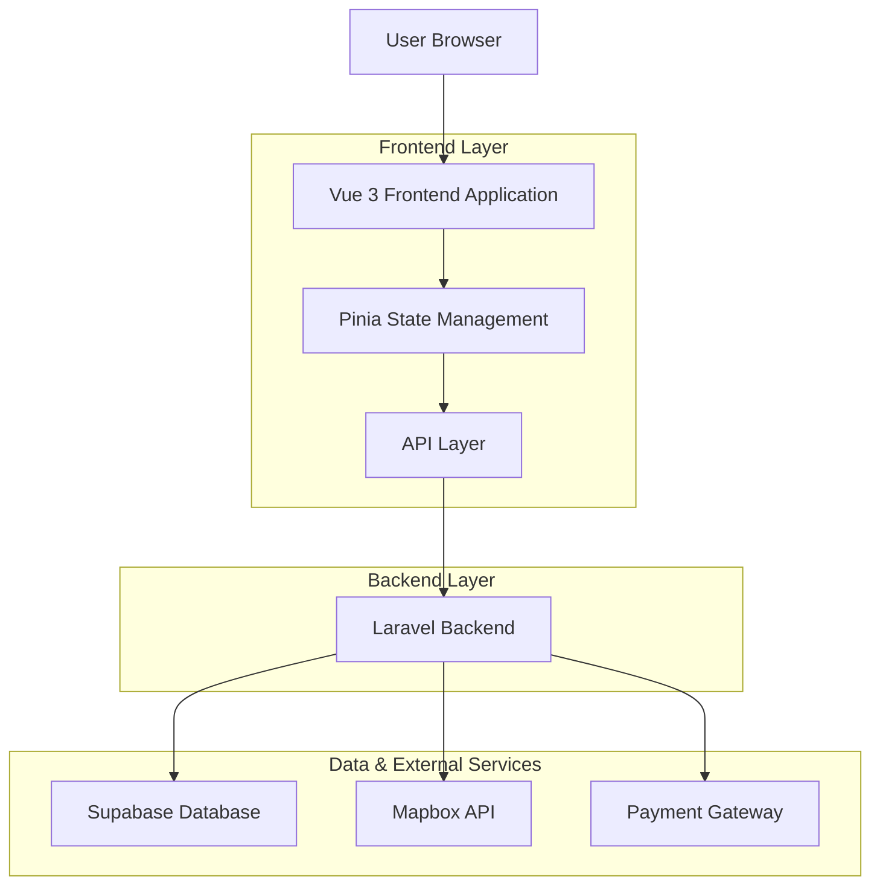
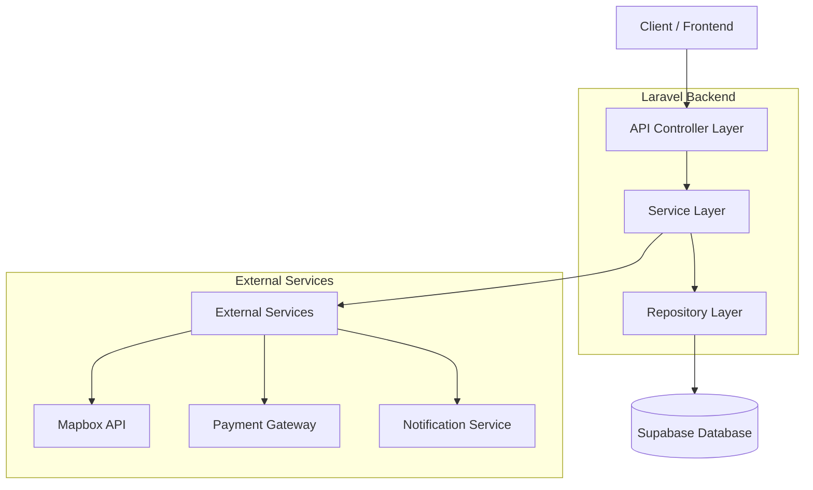
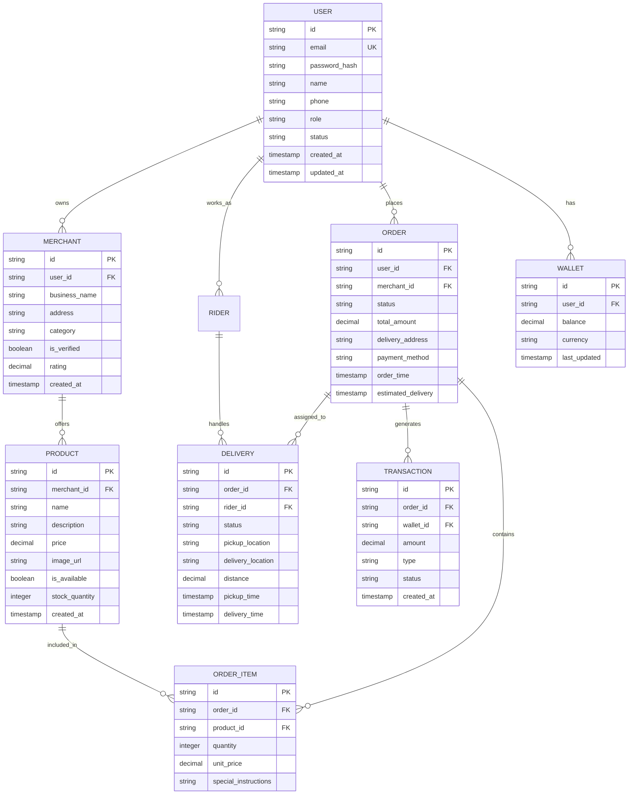

## 1. Architecture design



## 2. Technology Description

* **Frontend**: Vue 3 + Tailwind CSS + Pinia + Vite

* **Initialization Tool**: vite-init

* **Backend**: Laravel 11 (PHP)

* **Database**: Supabase (PostgreSQL)

* **Authentication**: Laravel Sanctum + Supabase Auth

* **Maps**: Mapbox API for geolocation and routing

* **Real-time**: Laravel Echo with Pusher

## 3. Route definitions

| Route               | Purpose                                         |
| ------------------- | ----------------------------------------------- |
| /                   | Customer home page with product browsing        |
| /login              | User authentication with role-based redirection |
| /admin/dashboard    | Admin system overview and user management       |
| /merchant/dashboard | Merchant product and order management           |
| /rider/dashboard    | Rider delivery management and earnings          |
| /customer/profile   | Customer profile and order history              |
| /cart               | Shopping cart and checkout process              |
| /orders/:id/track   | Real-time order tracking                        |
| /merchant/products  | Product catalog management                      |
| /merchant/orders    | Order processing interface                      |
| /rider/deliveries   | Available delivery requests                     |

## 4. API definitions

### 4.1 Authentication APIs

```
POST /api/auth/login
```

Request:

| Param Name | Param Type | isRequired | Description                               |
| ---------- | ---------- | ---------- | ----------------------------------------- |
| email      | string     | true       | User email address                        |
| password   | string     | true       | User password                             |
| role       | string     | true       | User role (admin/merchant/rider/customer) |

Response:

| Param Name | Param Type | Description                         |
| ---------- | ---------- | ----------------------------------- |
| token      | string     | JWT authentication token            |
| user       | object     | User profile data                   |
| role       | string     | User role for dashboard redirection |

Example:

```json
{
  "email": "merchant@example.com",
  "password": "securepassword123",
  "role": "merchant"
}
```

### 4.2 Order Management APIs

```
POST /api/orders/create
```

Request:

| Param Name        | Param Type | isRequired | Description                            |
| ----------------- | ---------- | ---------- | -------------------------------------- |
| items             | array      | true       | Array of product items with quantities |
| delivery\_address | object     | true       | Delivery address details               |
| payment\_method   | string     | true       | Payment method selection               |
| scheduled\_time   | string     | false      | Optional scheduled delivery time       |

### 4.3 Product APIs

```
GET /api/products
```

Query Parameters:

| Param Name   | Param Type | isRequired | Description                 |
| ------------ | ---------- | ---------- | --------------------------- |
| category     | string     | false      | Filter by category          |
| merchant\_id | string     | false      | Filter by specific merchant |
| search       | string     | false      | Search term for products    |
| page         | number     | false      | Pagination page number      |

## 5. Server architecture diagram



## 6. Data model

### 6.1 Data model definition



### 6.2 Data Definition Language

User Table (users)

```sql
-- create table
CREATE TABLE users (
    id UUID PRIMARY KEY DEFAULT gen_random_uuid(),
    email VARCHAR(255) UNIQUE NOT NULL,
    password_hash VARCHAR(255) NOT NULL,
    name VARCHAR(100) NOT NULL,
    phone VARCHAR(20),
    role VARCHAR(20) NOT NULL CHECK (role IN ('admin', 'merchant', 'rider', 'customer')),
    status VARCHAR(20) DEFAULT 'active' CHECK (status IN ('active', 'suspended', 'deleted')),
    created_at TIMESTAMP WITH TIME ZONE DEFAULT NOW(),
    updated_at TIMESTAMP WITH TIME ZONE DEFAULT NOW()
);

-- create indexes
CREATE INDEX idx_users_email ON users(email);
CREATE INDEX idx_users_role ON users(role);
CREATE INDEX idx_users_status ON users(status);

-- grant permissions
GRANT SELECT ON users TO anon;
GRANT ALL PRIVILEGES ON users TO authenticated;
```

Product Table (products)

```sql
-- create table
CREATE TABLE products (
    id UUID PRIMARY KEY DEFAULT gen_random_uuid(),
    merchant_id UUID NOT NULL,
    name VARCHAR(255) NOT NULL,
    description TEXT,
    price DECIMAL(10,2) NOT NULL CHECK (price >= 0),
    image_url VARCHAR(500),
    is_available BOOLEAN DEFAULT true,
    stock_quantity INTEGER DEFAULT 0 CHECK (stock_quantity >= 0),
    created_at TIMESTAMP WITH TIME ZONE DEFAULT NOW(),
    updated_at TIMESTAMP WITH TIME ZONE DEFAULT NOW()
);

-- create indexes
CREATE INDEX idx_products_merchant_id ON products(merchant_id);
CREATE INDEX idx_products_available ON products(is_available);
CREATE INDEX idx_products_price ON products(price);

-- grant permissions
GRANT SELECT ON products TO anon;
GRANT ALL PRIVILEGES ON products TO authenticated;
```

Order Table (orders)

```sql
-- create table
CREATE TABLE orders (
    id UUID PRIMARY KEY DEFAULT gen_random_uuid(),
    user_id UUID NOT NULL,
    merchant_id UUID NOT NULL,
    status VARCHAR(50) NOT NULL DEFAULT 'pending' CHECK (status IN ('pending', 'confirmed', 'preparing', 'ready', 'assigned', 'picked_up', 'delivered', 'cancelled')),
    total_amount DECIMAL(10,2) NOT NULL CHECK (total_amount >= 0),
    delivery_address TEXT NOT NULL,
    payment_method VARCHAR(50) NOT NULL,
    order_time TIMESTAMP WITH TIME ZONE DEFAULT NOW(),
    estimated_delivery TIMESTAMP WITH TIME ZONE,
    created_at TIMESTAMP WITH TIME ZONE DEFAULT NOW(),
    updated_at TIMESTAMP WITH TIME ZONE DEFAULT NOW()
);

-- create indexes
CREATE INDEX idx_orders_user_id ON orders(user_id);
CREATE INDEX idx_orders_merchant_id ON orders(merchant_id);
CREATE INDEX idx_orders_status ON orders(status);
CREATE INDEX idx_orders_created_at ON orders(created_at DESC);

-- grant permissions
GRANT SELECT ON orders TO anon;
GRANT ALL PRIVILEGES ON orders TO authenticated;
```

Delivery Table (deliveries)

```sql
-- create table
CREATE TABLE deliveries (
    id UUID PRIMARY KEY DEFAULT gen_random_uuid(),
    order_id UUID NOT NULL UNIQUE,
    rider_id UUID,
    status VARCHAR(50) NOT NULL DEFAULT 'pending' CHECK (status IN ('pending', 'assigned', 'picked_up', 'in_transit', 'delivered', 'failed')),
    pickup_location TEXT NOT NULL,
    delivery_location TEXT NOT NULL,
    distance DECIMAL(8,2),
    pickup_time TIMESTAMP WITH TIME ZONE,
    delivery_time TIMESTAMP WITH TIME ZONE,
    created_at TIMESTAMP WITH TIME ZONE DEFAULT NOW(),
    updated_at TIMESTAMP WITH TIME ZONE DEFAULT NOW()
);

-- create indexes
CREATE INDEX idx_deliveries_order_id ON deliveries(order_id);
CREATE INDEX idx_deliveries_rider_id ON deliveries(rider_id);
CREATE INDEX idx_deliveries_status ON deliveries(status);

-- grant permissions
GRANT SELECT ON deliveries TO anon;
GRANT ALL PRIVILEGES ON deliveries TO authenticated;
```

